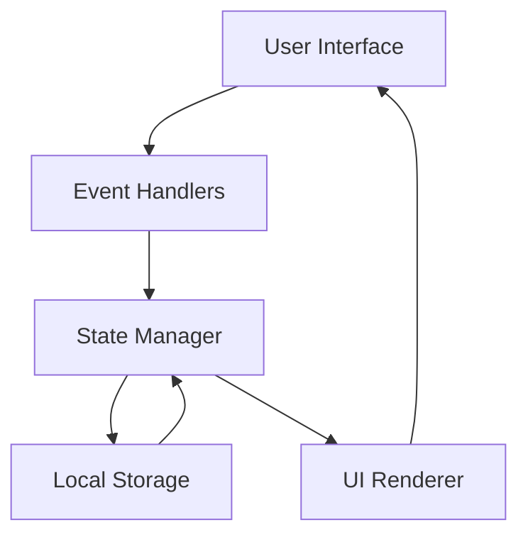

# Design Document: Expense & Budget Visualizer

## Overview

The Expense & Budget Visualizer is a single-page web application built with vanilla JavaScript, HTML, and CSS. The application follows a modular architecture with clear separation between data management, UI rendering, and business logic. All data operations are synchronous and use the browser's Local Storage API for persistence.

The application consists of four main UI components:
1. **Balance Display** - Shows total spending at the top of the interface
2. **Input Form** - Allows users to create new transactions
3. **Transaction List** - Displays all transactions with delete controls
4. **Chart Component** - Visualizes spending distribution by category using Chart.js

The architecture emphasizes simplicity and maintainability, with a clear data flow: user actions trigger state updates, which persist to Local Storage and trigger UI re-renders.

## Architecture

### High-Level Architecture



### File Structure

The application consists of only 3 files:

```
expense-budget-visualizer/
├── index.html          # HTML structure
├── css/
│   └── styles.css      # All styling
└── js/
    └── app.js          # All JavaScript logic
```

### Component Structure

All JavaScript code is contained in a single `js/app.js` file, organized into logical sections:

1. **State Manager Section**
   - Manages the transaction list as the single source of truth
   - Provides methods for adding, deleting, and retrieving transactions
   - Handles Local Storage synchronization

2. **Storage Service Section**
   - Encapsulates Local Storage API interactions
   - Provides methods for saving and loading transaction data
   - Handles serialization/deserialization of transaction objects

3. **UI Renderer Section**
   - Balance Display: Calculates and renders total spending
   - Input Form: Handles user input and validation
   - Transaction List: Renders transaction items with delete controls
   - Chart Component: Integrates Chart.js for pie chart visualization

4. **Event Handlers Section**
   - Binds user interactions to state operations
   - Handles form submission and validation
   - Manages delete button clicks

5. **Initialization Section**
   - Initializes the application on page load
   - Loads initial data from Local Storage
   - Sets up event listeners
   - Coordinates component interactions

### Data Flow

1. **Transaction Creation Flow**:
   - User fills form → Form validation → State update → Local Storage save → UI re-render

2. **Transaction Deletion Flow**:
   - User clicks delete → State update → Local Storage save → UI re-render

3. **Application Load Flow**:
   - Page load → Load from Local Storage → Initialize state → Render all components

## Components and Interfaces

### State Management Functions

**Responsibilities**:
- Maintain transaction list in memory
- Provide CRUD operations for transactions
- Coordinate with Storage Service for persistence

**Key Functions**:
```javascript
// Returns all transactions
function getTransactions(): Transaction[]

// Adds a transaction and persists to storage
function addTransaction(transaction: Transaction): void

// Removes a transaction by ID and persists to storage
function deleteTransaction(id: string): void

// Calculates total of all transaction amounts
function getBalance(): number

// Groups transactions by category with totals
function getCategoryTotals(): { [category: string]: number }
```

### Storage Functions

**Responsibilities**:
- Abstract Local Storage API
- Handle JSON serialization/deserialization
- Provide error handling for storage operations

**Key Functions**:
```javascript
// Saves transaction array to Local Storage
function saveToStorage(transactions: Transaction[]): void

// Loads transaction array from Local Storage
function loadFromStorage(): Transaction[]
```

### UI Rendering Functions

**Responsibilities**:
- Render all UI components
- Update DOM based on state changes
- Handle UI-specific logic (formatting, styling)

**Key Functions**:
```javascript
// Renders the balance display
function renderBalance(): void

// Renders the transaction list
function renderTransactionList(): void

// Renders the pie chart
function renderChart(): void

// Clears the input form
function clearForm(): void

// Displays an error message
function showError(message: string): void

// Renders all components
function renderAll(): void
```

### Event Handler Functions

**Responsibilities**:
- Bind DOM events to application logic
- Validate form input
- Coordinate between UI and State Management

**Key Functions**:
```javascript
// Sets up all event listeners
function initializeEventListeners(): void

// Handles form submission
function handleFormSubmit(event: Event): void

// Handles delete button clicks
function handleDelete(transactionId: string): void

// Validates form input
function validateForm(itemName: string, amount: string, category: string): boolean
```

## Data Models

### Transaction

A transaction represents a single expense entry.

**Structure**:
```javascript
{
  id: string,        // Unique identifier (timestamp-based or UUID)
  itemName: string,  // Name of the expense item
  amount: number,    // Expense amount (positive number)
  category: string   // One of: "Food", "Transport", "Fun"
}
```

**Validation Rules**:
- `id`: Must be unique, non-empty string
- `itemName`: Must be non-empty string after trimming whitespace
- `amount`: Must be a positive number (> 0)
- `category`: Must be one of the three allowed values: "Food", "Transport", "Fun"

**Example**:
```javascript
{
  id: "1704067200000",
  itemName: "Grocery Shopping",
  amount: 45.50,
  category: "Food"
}
```

### Local Storage Schema

Transactions are stored as a JSON array under a single key.

**Storage Key**: `expense-tracker-transactions`

**Format**:
```javascript
[
  {
    id: "1704067200000",
    itemName: "Grocery Shopping",
    amount: 45.50,
    category: "Food"
  },
  {
    id: "1704067201000",
    itemName: "Bus Ticket",
    amount: 2.50,
    category: "Transport"
  }
]
```

### Category Totals

Used internally for chart rendering and category analysis.

**Structure**:
```javascript
{
  "Food": number,
  "Transport": number,
  "Fun": number
}
```

**Example**:
```javascript
{
  "Food": 125.75,
  "Transport": 45.00,
  "Fun": 80.25
}
```


## Correctness Properties

*A property is a characteristic or behavior that should hold true across all valid executions of a system—essentially, a formal statement about what the system should do. Properties serve as the bridge between human-readable specifications and machine-verifiable correctness guarantees.*

### Property 1: Form Validation Rejects Invalid Input

*For any* form submission where one or more fields (itemName, amount, or category) are empty or invalid, the application should reject the submission, display an error message, and prevent transaction creation.

**Validates: Requirements 1.3, 1.4**

### Property 2: Valid Transaction Creation

*For any* valid transaction data (non-empty itemName, positive amount, valid category), submitting the form should result in a new transaction being added to the transaction list with a unique ID.

**Validates: Requirements 1.5, 1.6**

### Property 3: Form Clearing After Submission

*For any* successful transaction creation, the input form fields should be cleared and ready for the next entry.

**Validates: Requirements 1.7**

### Property 4: Storage Round-Trip Preservation

*For any* list of transactions, saving to Local Storage and then loading should produce an equivalent transaction list with all transaction properties preserved.

**Validates: Requirements 1.8, 3.3, 6.1, 6.2, 6.3, 6.4**

### Property 5: Transaction Rendering Completeness

*For any* transaction in the transaction list, the rendered HTML should contain the transaction's itemName, amount, and category.

**Validates: Requirements 2.1, 2.2**

### Property 6: Delete Control Presence

*For any* non-empty transaction list, each rendered transaction should have an associated delete control.

**Validates: Requirements 3.1**

### Property 7: Transaction Deletion Removes from List

*For any* transaction in the list, activating its delete control should remove that specific transaction from the transaction list.

**Validates: Requirements 3.2**

### Property 8: Balance Equals Sum of Amounts

*For any* transaction list (including empty), the displayed balance should equal the sum of all transaction amounts, with an empty list showing zero.

**Validates: Requirements 4.1, 4.2, 4.3, 4.5**

### Property 9: Category Totals Accuracy

*For any* transaction list, the calculated total for each category (Food, Transport, Fun) should equal the sum of amounts for all transactions in that category.

**Validates: Requirements 5.2**

### Property 10: Category Percentages Sum to 100%

*For any* non-empty transaction list, the percentages calculated for all categories should sum to 100% (within floating-point precision), and each category's percentage should accurately reflect its proportion of total spending.

**Validates: Requirements 5.3**

## Error Handling

### Input Validation Errors

**Empty Field Validation**:
- Check all form fields before submission
- Display specific error message indicating which field is empty
- Error message format: "Please fill in all fields"
- Prevent form submission and transaction creation
- Keep existing form values to allow user correction

**Invalid Amount Validation**:
- Verify amount is a valid number
- Verify amount is positive (> 0)
- Error message: "Please enter a valid positive amount"
- Reject non-numeric input (letters, special characters)

**Category Validation**:
- Verify selected category is one of: Food, Transport, Fun
- This should be enforced by HTML select element, but validate in JavaScript as well
- Error message: "Please select a valid category"

### Storage Errors

**Local Storage Unavailable**:
- Detect if Local Storage is disabled or unavailable
- Display warning message: "Local Storage is not available. Your data will not be saved."
- Allow application to function in memory-only mode
- Gracefully degrade functionality

**Storage Quota Exceeded**:
- Catch QuotaExceededError when saving
- Display error message: "Storage limit reached. Please delete some transactions."
- Prevent new transaction creation until space is available
- Existing transactions remain accessible

**Corrupted Data**:
- Wrap JSON.parse in try-catch block
- If parsing fails, log error and initialize with empty array
- Display warning: "Could not load previous data. Starting fresh."
- Do not crash the application

### Chart Rendering Errors

**Chart.js Load Failure**:
- Check if Chart.js library loaded successfully
- If not available, display message: "Chart visualization unavailable"
- Rest of application continues to function normally

**Empty Data Set**:
- When transaction list is empty, display placeholder message
- Message: "No transactions yet. Add some expenses to see your spending breakdown."
- Do not attempt to render chart with empty data

**Invalid Data**:
- Validate category totals before passing to Chart.js
- Ensure all values are non-negative numbers
- Filter out any invalid data points

## Testing Strategy

### Overview

The testing strategy employs a dual approach combining unit tests for specific scenarios and property-based tests for comprehensive validation of universal properties. This ensures both concrete correctness and general behavioral guarantees.

### Unit Testing

Unit tests will focus on:

1. **Specific Examples**: Concrete test cases that demonstrate correct behavior
   - Adding a transaction with specific values
   - Deleting a specific transaction
   - Loading a known set of transactions from storage

2. **Edge Cases**: Boundary conditions and special scenarios
   - Empty transaction list
   - Single transaction
   - Maximum reasonable number of transactions
   - Transactions with very small amounts (0.01)
   - Transactions with large amounts (999999.99)

3. **Error Conditions**: Invalid inputs and error handling
   - Empty form fields
   - Negative amounts
   - Zero amounts
   - Non-numeric amounts
   - Invalid category values
   - Storage unavailable scenarios

4. **Integration Points**: Component interactions
   - State Manager ↔ Storage Service
   - State Manager ↔ UI Renderer
   - Event Handler ↔ State Manager

**Unit Test Framework**: Use a lightweight testing framework like Jest or Mocha for browser-based testing.

### Property-Based Testing

Property-based tests will validate universal properties across randomly generated inputs. Each test will run a minimum of 100 iterations to ensure comprehensive coverage.

**Property-Based Testing Library**: Use a JavaScript property-based testing library such as:
- **fast-check** (recommended for JavaScript)
- **jsverify** (alternative)

**Test Configuration**:
- Minimum 100 iterations per property test
- Each test must reference its design document property using a comment tag
- Tag format: `// Feature: expense-budget-visualizer, Property {number}: {property_text}`

**Property Test Coverage**:

1. **Property 1 - Form Validation**: Generate random form inputs with various combinations of empty/invalid fields and verify rejection
   - Tag: `// Feature: expense-budget-visualizer, Property 1: Form Validation Rejects Invalid Input`

2. **Property 2 - Transaction Creation**: Generate random valid transactions and verify they are added to the list
   - Tag: `// Feature: expense-budget-visualizer, Property 2: Valid Transaction Creation`

3. **Property 3 - Form Clearing**: Generate random transactions, submit, and verify form is cleared
   - Tag: `// Feature: expense-budget-visualizer, Property 3: Form Clearing After Submission`

4. **Property 4 - Storage Round-Trip**: Generate random transaction lists, save and load, verify equivalence
   - Tag: `// Feature: expense-budget-visualizer, Property 4: Storage Round-Trip Preservation`

5. **Property 5 - Rendering Completeness**: Generate random transactions and verify all fields appear in rendered HTML
   - Tag: `// Feature: expense-budget-visualizer, Property 5: Transaction Rendering Completeness`

6. **Property 6 - Delete Controls**: Generate random transaction lists and verify each has a delete control
   - Tag: `// Feature: expense-budget-visualizer, Property 6: Delete Control Presence`

7. **Property 7 - Deletion**: Generate random transaction lists, delete random transactions, verify removal
   - Tag: `// Feature: expense-budget-visualizer, Property 7: Transaction Deletion Removes from List`

8. **Property 8 - Balance Calculation**: Generate random transaction lists and verify balance equals sum
   - Tag: `// Feature: expense-budget-visualizer, Property 8: Balance Equals Sum of Amounts`

9. **Property 9 - Category Totals**: Generate random transaction lists and verify category sums are correct
   - Tag: `// Feature: expense-budget-visualizer, Property 9: Category Totals Accuracy`

10. **Property 10 - Category Percentages**: Generate random transaction lists and verify percentages sum to 100%
    - Tag: `// Feature: expense-budget-visualizer, Property 10: Category Percentages Sum to 100%`

**Generators for Property Tests**:

```javascript
// Generator for valid transactions
const validTransactionGen = fc.record({
  itemName: fc.string({ minLength: 1 }),
  amount: fc.double({ min: 0.01, max: 999999.99 }),
  category: fc.constantFrom('Food', 'Transport', 'Fun')
});

// Generator for transaction lists
const transactionListGen = fc.array(validTransactionGen, { maxLength: 100 });

// Generator for invalid form inputs (at least one field empty/invalid)
const invalidFormGen = fc.oneof(
  fc.record({ itemName: fc.constant(''), amount: fc.double(), category: fc.string() }),
  fc.record({ itemName: fc.string(), amount: fc.constant(0), category: fc.string() }),
  fc.record({ itemName: fc.string(), amount: fc.double(), category: fc.constant('') })
);
```

### Test Organization

All tests will be organized in a simple structure:

```
tests/
├── unit.test.js           # Unit tests for specific scenarios
└── property.test.js       # Property-based tests for universal properties
```

### Testing Balance

- **Unit tests** should be focused and specific, avoiding excessive duplication
- **Property tests** handle comprehensive input coverage through randomization
- Together, they provide both concrete examples and general correctness guarantees
- Avoid writing too many unit tests for scenarios that property tests already cover
- Focus unit tests on integration points, error conditions, and specific edge cases

### Continuous Testing

- Run tests on every code change during development
- Use a test runner with watch mode for rapid feedback
- Ensure all tests pass before committing code
- Property tests should complete in reasonable time (< 30 seconds total)
